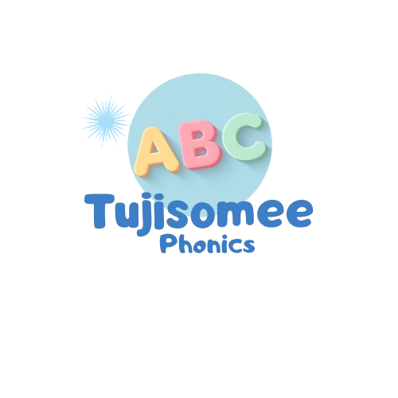

<p align="center">
  
</p>


**Tujisomee Phonics** is a vibrant, interactive, and child-friendly educational application built with Python and Kivy. Designed specifically for early childhood literacy, the app helps young children master letter sounds (A–Z) in both **English** and **Kiswahili** through dual learning views, tactile bounce animations, and instant audio feedback.

---

## ✨ Key Features

- **📱 Dual Learning Modes:** Switch seamlessly between a full 26-letter **Grid View** (pairing upper & lowercase letters like "A a") and a giant interactive **Flashcard View**.
- **🌐 Dynamic Instant Localization:** Change the language between **English** and **Kiswahili** at any time using the header dropdown selector without restarting the app.
- **💾 State Persistence:** User preferences (selected language and preferred view mode) are automatically saved locally and reloaded across sessions.
- **🔊 Interactive Phonics Audio:** Asynchronous audio playback triggers automatically when swiping to new flashcards or tapping letter tiles.
- **🏠 Home Navigation Bar:** Clean bottom navigation bar with a quick home action button (`🏠 Home` / `🏠 Mwanzo`) returning users to the setup onboarding screen.
- **🎨 Kid-Friendly UI/UX:** Soft pastel colors, large tap targets, high contrast typography, and bouncy tactile feedback engineered for young learners.

---

## 📁 Project Structure

```text
tujisomee_py/
│
├── main_app.py               # Main application entry point & ScreenManager router
├── requirements.txt          # Dependencies list
├── user_settings.json        # Auto-generated local user settings storage (untracked)
├── README.md                 # Project documentation
│
├── screens/                  # Application screens
│   ├── onboarding.py         # Step 1: Welcome & language selection
│   ├── onboarding_step2.py   # Step 2: Learning view selection (Grid vs Card)
│   ├── onboarding_step3.py   # Step 3: Confirmation setup screen
│   └── main_screen.py        # Core learning interface (Grid / Card views & controls)
│
├── ui/                       # Reusable UI components
│   └── kid_button.py         # Custom rounded button with bounce animation
│
├── utils/                    # Helper utilities & state persistence
│   ├── storage.py            # Local JSON settings load/save manager
│   └── mp3.py                # Asynchronous audio sound loader
│
└── assets/                   # App assets
    ├── logo.png              # Mascot logo
    └── mp3/                  # English and Kiswahili audio files (a.mp3 – z.mp3)

```

---

## 🚀 Getting Started

### 1. Prerequisites

Ensure you have **Python 3.9+** installed on your system.

### 2. Installation & Setup

1. **Clone the repository:**
```bash
git clone [https://github.com/margaretnduta/tujisomee_py.git](https://github.com/margaretnduta/tujisomee_py.git)
cd tujisomee_py

```


2. **Set up a virtual environment (Recommended):**
```bash
# Windows
python -m venv venv
.\venv\Scripts\activate

# Mac/Linux
python3 -m venv venv
source venv/bin/activate

```


3. **Install dependencies:**
```bash
pip install -r requirements.txt

```


---

## 🎮 Running the Application

Execute the primary application launcher:

```bash
python main_app.py

```

---

## 🛠️ Tech Stack

* **Language:** Python 3.13+
* **Framework:** [Kivy](https://kivy.org/) (Core UI components, ScreenManager, Graphics Canvas)
* **Audio Engine:** `kivy.core.audio` (Non-blocking audio playback)
* **Storage:** JSON persistence (`utils/storage.py`)

---

## 🛣️ Roadmap

* [x] **Phase 1: Multi-Step Onboarding** (Welcome, language choice, and mode preference)
* [x] **Phase 2: Core Learning Screen & Settings Persistence** (Grid/Card views, live language toggle, home navigation)
* [ ] **Phase 3: Gamification & Interactive Quiz Mode** ("Find the Letter" mini-game, star rewards, audio challenges)
* [ ] **Phase 4: Illustrated Mascot Assets & Sound FX** (Enhanced audio effects and visual polish)
* [ ] **Phase 5: Android Build** (Compilation to `.apk` via Buildozer)

---

## 📄 License

This project is licensed under the MIT License.
